---
## Front matter
title: "Шаблон отчёта по лабораторной работе "
subtitle: "4"
author: "Сильвен Макс Грегор Филс ,  НКАбд-03-22"

## Generic otions
lang: ru-RU
toc-title: "Содержание"

## Bibliography
bibliography: bib/cite.bib
csl: pandoc/csl/gost-r-7-0-5-2008-numeric.csl

## Pdf output format
toc: true # Table of contents
toc-depth: 2
lof: true # List of figures
lot: true # List of tables
fontsize: 12pt
linestretch: 1.5
papersize: a4
documentclass: scrreprt
## I18n polyglossia
polyglossia-lang:
  name: russian
  options:
	- spelling=modern
	- babelshorthands=true
polyglossia-otherlangs:
  name: english
## I18n babel
babel-lang: russian
babel-otherlangs: english
## Fonts
mainfont: PT Serif
romanfont: PT Serif
sansfont: PT Sans
monofont: PT Mono
mainfontoptions: Ligatures=TeX
romanfontoptions: Ligatures=TeX
sansfontoptions: Ligatures=TeX,Scale=MatchLowercase
monofontoptions: Scale=MatchLowercase,Scale=0.9
## Biblatex
biblatex: true
biblio-style: "gost-numeric"
biblatexoptions:
  - parentracker=true
  - backend=biber
  - hyperref=auto
  - language=auto
  - autolang=other*
  - citestyle=gost-numeric
## Pandoc-crossref LaTeX customization
figureTitle: "Рис."
tableTitle: "Таблица"
listingTitle: "Листинг"
lofTitle: "Список иллюстраций"
lotTitle: "Список таблиц"
lolTitle: "Листинги"
## Misc options
indent: true
header-includes:
  - \usepackage{indentfirst}
  - \usepackage{float} # keep figures where there are in the text
  - \floatplacement{figure}{H} # keep figures where there are in the text
---

# Цель работы
В этой лабораторной работе мы рассмотрим более простой способ написа-
ния лабораторного отчета с использованием облегченного языка разметки
Markdown

# Выполнение лабораторной работы

- Прежде всего, мы открываем терминал и переходим в каталог, созданный
во время выполнения третьего круга, когда мы обновляем и загружаем
изменения из удаленного репозитория с помощью команды **git pull**. (рис. [-@fig:fig1])

 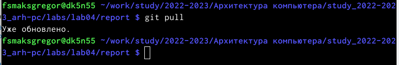{ #fig:fig1 width=110%}
 
 \
 \
 
 - Затем мы перешли к каталогу с шаблоном для лабораторного отчета No 4. Затем мы скомпилировали шаблон, используя Makefile с помощью команды make. (рис. [-@fig:fig2])
 
 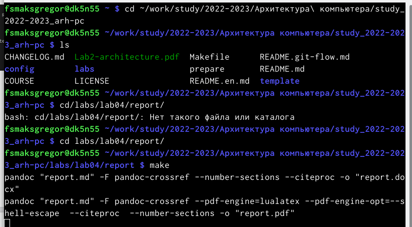{ #fig:fig2 width=110%}
 
 - После успешной компиляции мы получили два файла report.docx и report.pdf , мы смогли проверить это, используя как команду ls, так и графический файловый менеджер. (рис. [-@fig:fig3])(рис. [-@fig:fig4])
 
  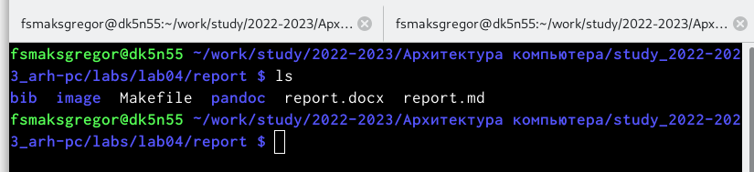{ #fig:fig3 width=110%}
  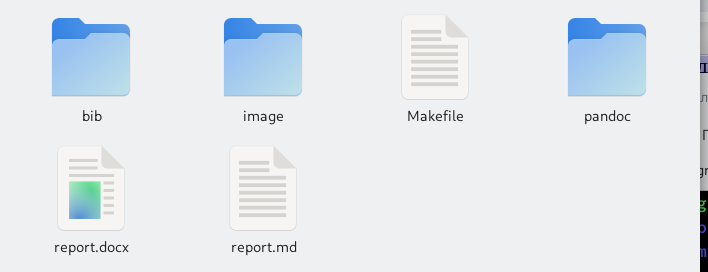{ #fig:fig4 width=110%}
 
  
  
  
- После этого мы удалили созданные файлы с помощью makefile с помощью команды make clean и мы проверили, что файлы действительно были удалены с помощью команды ls. (рис. [-@fig:fig5])

 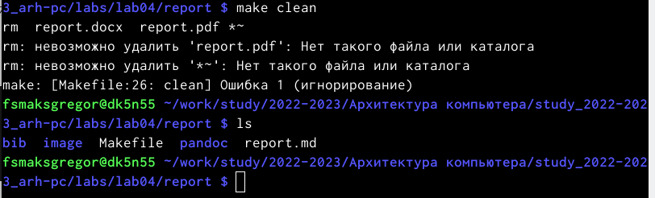{ #fig:fig5 width=110%}

- После этого мы заполнили отчет report.md и скомпилировал выходные данные. (рис. [-@fig:fig6])
 (рис. [-@fig:fig7])
 
  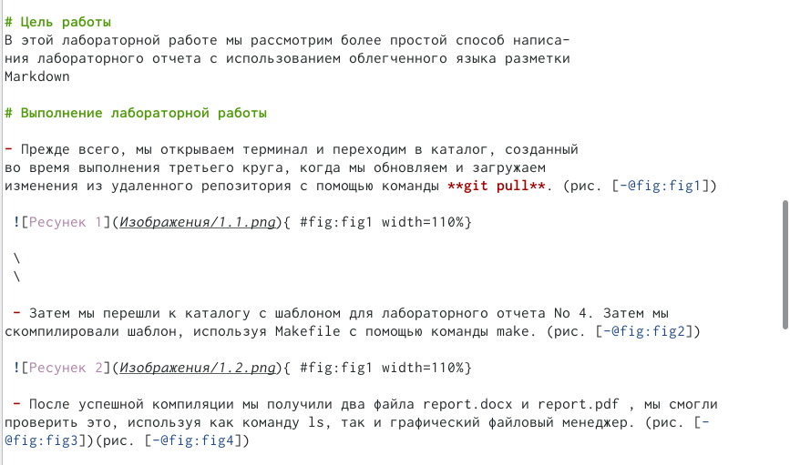{ #fig:fig6 width=110%}
  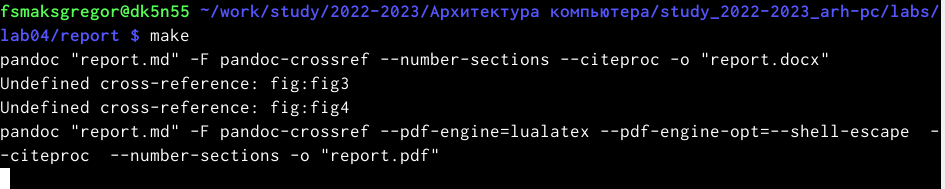{ #fig:fig7 width=110%}
  
- Затем нам нужно было поместить созданные файлы в ваш удаленный репо-
зиторий, поэтому мы перешли в локальный репозиторий и ввели следую-
щие команды, как указано в 
  
# Теоретическое введение

Здесь описываются теоретические аспекты, связанные с выполнением работы.

Например, в табл. [-@tbl:std-dir] приведено краткое описание стандартных каталогов Unix.

: Описание некоторых каталогов файловой системы GNU Linux {#tbl:std-dir}

| Имя каталога | Описание каталога                                                                                                          |
|--------------|----------------------------------------------------------------------------------------------------------------------------|
| `/`          | Корневая директория, содержащая всю файловую                                                                               |
| `/bin `      | Основные системные утилиты, необходимые как в однопользовательском режиме, так и при обычной работе всем пользователям     |
| `/etc`       | Общесистемные конфигурационные файлы и файлы конфигурации установленных программ                                           |
| `/home`      | Содержит домашние директории пользователей, которые, в свою очередь, содержат персональные настройки и данные пользователя |
| `/media`     | Точки монтирования для сменных носителей                                                                                   |
| `/root`      | Домашняя директория пользователя  `root`                                                                                   |
| `/tmp`       | Временные файлы                                                                                                            |
| `/usr`       | Вторичная иерархия для данных пользователя                                                                                 |

Более подробно об Unix см. в [@gnu-doc:bash;@newham:2005:bash;@zarrelli:2017:bash;@robbins:2013:bash;@tannenbaum:arch-pc:ru;@tannenbaum:modern-os:ru].

# Задание для самостоятельной работы

- В этой части работы первое, что нам нужно сделать, это перейти в правиль-
ный каталог, который после этого был выделен для третьей лаборатории, и
с помощью команды gedit мы запустили файл report.md итак, мы можем
приступить к подаче третьего отчета.  (рис. [-@fig:fig8) (рис. [-@fig:fig9)
 
 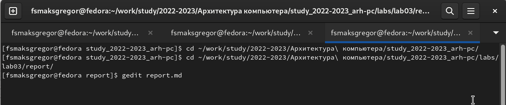{ #fig:fig8 width=110%}
 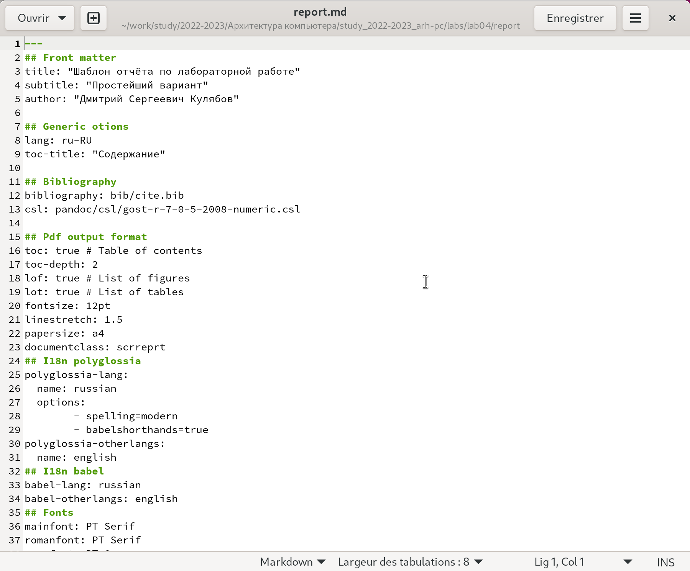{ #fig:fig9 width=110%}

- После этого мы заполнили отчет по результатам работы, проделанной в
третьей лаборатории.
- после заполнения отчета мы составили report.md используя makefile, ко-
торый предоставляет отчет в двух разных форматах.(рис. [-@fig:fig10)

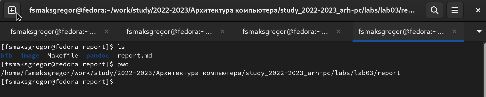{ #fig:fig10 width=110%}

- После этого мы перенесли все созданные файлы в удаленный репозиторий. (рис. [-@fig:fig11)
 
  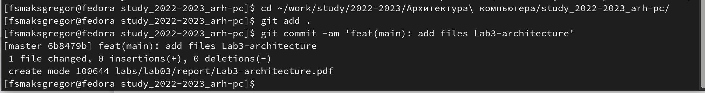{ #fig:fig11 width=110%}

# Выполнение лабораторной работы

Описываются проведённые действия, в качестве иллюстрации даётся ссылка на иллюстрацию (рис. [-@fig:001])

{ #fig:001 width=70% }

# Выводы

- в этих упражнениях мы применили все навыки, полученные в теорети-
ческой части, и попытались заполнить отчет для третьей лабораторной
работы, используя markdown, и переместили файлы в удаленное хранили-
ще в соответствующем каталоге

# Список литературы{.unnumbered}

::: {#refs}
:::
