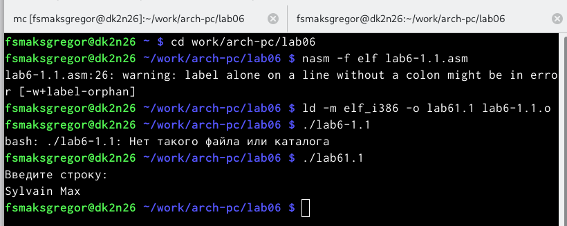

---
## Front matter
title: "Шаблон отчёта по лабораторной работе"
subtitle: "6"
author: "Сильвен Макс Грегор Филс , НКАбд-03-22"

## Generic otions
lang: ru-RU
toc-title: "Содержание"

## Bibliography
bibliography: bib/cite.bib
csl: pandoc/csl/gost-r-7-0-5-2008-numeric.csl

## Pdf output format
toc: true # Table of contents
toc-depth: 2
lof: true # List of figures
lot: true # List of tables
fontsize: 12pt
linestretch: 1.5
papersize: a4
documentclass: scrreprt
## I18n polyglossia
polyglossia-lang:
  name: russian
  options:
	- spelling=modern
	- babelshorthands=true
polyglossia-otherlangs:
  name: english
## I18n babel
babel-lang: russian
babel-otherlangs: english
## Fonts
mainfont: PT Serif
romanfont: PT Serif
sansfont: PT Sans
monofont: PT Mono
mainfontoptions: Ligatures=TeX
romanfontoptions: Ligatures=TeX
sansfontoptions: Ligatures=TeX,Scale=MatchLowercase
monofontoptions: Scale=MatchLowercase,Scale=0.9
## Biblatex
biblatex: true
biblio-style: "gost-numeric"
biblatexoptions:
  - parentracker=true
  - backend=biber
  - hyperref=auto
  - language=auto
  - autolang=other*
  - citestyle=gost-numeric
## Pandoc-crossref LaTeX customization
figureTitle: "Рис."
tableTitle: "Таблица"
listingTitle: "Листинг"
lofTitle: "Список иллюстраций"
lotTitle: "Список таблиц"
lolTitle: "Листинги"
## Misc options
indent: true
header-includes:
  - \usepackage{indentfirst}
  - \usepackage{float} # keep figures where there are in the text
  - \floatplacement{figure}{H} # keep figures where there are in the text
---

# Цель работы

- На шестой лабораторной работе мы научимся использовать “Midnight
commander” и освоим инструкции **mov** и **int** языка ассемблера.

# Выполнение лабораторной работы :
 - На этом этапе мы запустили mc.(рис. [-@fig:fig1])
 
 {#fig:fig1 width=110% }
 
 - После этого мы переместились в каталог ~/work/arch-pc.(рис. [-@fig:fig2])
 
 {#fig:fig2 width=110% }
 
 - После этого и с помощью клавиши f7 мы создали новую папку lab06.(рис. [-@fig:fig3])
 
 {#fig:fig3 width=110% }
 
 
 -  Используя строку ввода и сенсорную команду, мы создали файл lab6-1.asm.(рис. [-@fig:fig4])
 
 {#fig:fig4 width=110% }
 
 - Используя функциональную клавишу F4, мы открыли файл lab6-1.asm. (рис. [-@fig:fig5])
 
 {#fig:fig5 width=110% }
 
 - Мы скопировали текст программы из листинга 6.1 в файл asm, затем со-
хранили изменения и закрыли файл. (рис. [-@fig:fig6])

 {#fig:fig6 width=110% }

- Используя функциональную клавишу F3, мы открыли файл lab6-1.asm для
просмотра. и мы проверили, что файл содержит текст программы. (рис. [-@fig:fig7])
 
{#fig:fig7 width=110% }

- Затем мы перевели текст программы lab6-1.asm в объектный файл . Вы-
полнил разметку объектного файла и запустил полученный исполняемый
файл, где программа выводит строку ‘Введите строку:’ и ожидает ввода с
клавиатуры. По запросу, в этот момент мы ввели наше имя и фамилию.(рис. [-@fig:fig8])
 
 {#fig:fig8 width=110% }

- После этого мы загрузили файл in_out.asm из ТУИСА и с помощью mc мы
смогли переместить файл в правильный каталог. (рис. [-@fig:fig9])

 {#fig:fig9 width=110% }
 
 - Используя функциональную клавишу f5, мы создали копию файла lab6-
1.asm с именем lab6-2.asm.(рис. [-@fig:fig10])

 {#fig:fig10 width=110% }

- После этого мы исправляем текст программы в файле lab6-2.asm, используя
подпрограммы из внешнего файла in_out.asm.(рис. [-@fig:fig11])

 {#fig:fig11 width=110% }
 
 - Затем мы перевели текст программы lab6-2.asm в объектный файл . Вы-
полнил разметку объектного файла и запустил полученный исполняемый
файл.(рис. [-@fig:fig12]) 

 {#fig:fig12 width=110% }
 
 - На этом шаге мы меняем функцию sprintLF на функцию sprint Создал
исполняемый файл, и разница заключалась в том, что эта функция изменяет
входные данные на новую строку.(рис. [-@fig:fig13])(рис. [-@fig:fig14])

{#fig:fig13 width=110% }
{#fig:fig14 width=110% }

## Выводы по результатам выполнения заданий :

- В ходе лабораторных работ мы узнали, как использовать midnight
commander, и мы овладели навыками использования инструмента nasm.

# Задание для самостоятельной работы :

## Создание программы без использования внешнего файла  

- В этой части мы должны были сделать копию файла lab6-1.asm, а затем мы
должны были создать программу, которая запрашивает ввод строки, затем
позволяет выполнить ввод с клавиатуры и, наконец, отобразить введенную
строку, но без использования внешнего файла in_out.асм.(рис. [-@fig:fig13] 
)                             |

 {#fig:fig15 width=110% }

### создание программы с использованием внешнего файла

- в этой части мы попытались выполнить ту же программу, но с использова-
нием внешнего файла.(рис. [-@fig:fig16]) 

 {#fig:fig16 width=110% }
 
#### Выводы по результатам выполнения заданий :

- В этой части мы узнали, как создавать и редактировать программы с помощью
подпрограмм и как управлять с помощью языка ассемблера.

Более подробно об Unix см. в [@gnu-doc:bash;@newham:2005:bash;@zarrelli:2017:bash;@robbins:2013:bash;@tannenbaum:arch-pc:ru;@tannenbaum:modern-os:ru].

# Выводы

- На шестой лабораторной работе мы научимся использовать “Midnight
commander” и освоим инструкции mov и int языка ассемблера и мы узнали,
как создавать и редактировать программы с помощью подпрограмм и как
управлять с помощью языка ассемблера.

# Список литературы{.unnumbered}

::: {#refs}
:::
