---
## Front matter
title: "Шаблон отчёта по лабораторной работе"
subtitle: "9"
author: "Сильвен Макс Грегор Филс , НКАбд-03-22"

## Generic otions
lang: ru-RU
toc-title: "Содержание"

## Bibliography
bibliography: bib/cite.bib
csl: pandoc/csl/gost-r-7-0-5-2008-numeric.csl

## Pdf output format
toc: true # Table of contents
toc-depth: 2
lof: true # List of figures
lot: true # List of tables
fontsize: 12pt
linestretch: 1.5
papersize: a4
documentclass: scrreprt
## I18n polyglossia
polyglossia-lang:
  name: russian
  options:
	- spelling=modern
	- babelshorthands=true
polyglossia-otherlangs:
  name: english
## I18n babel
babel-lang: russian
babel-otherlangs: english
## Fonts
mainfont: PT Serif
romanfont: PT Serif
sansfont: PT Sans
monofont: PT Mono
mainfontoptions: Ligatures=TeX
romanfontoptions: Ligatures=TeX
sansfontoptions: Ligatures=TeX,Scale=MatchLowercase
monofontoptions: Scale=MatchLowercase,Scale=0.9
## Biblatex
biblatex: true
biblio-style: "gost-numeric"
biblatexoptions:
  - parentracker=true
  - backend=biber
  - hyperref=auto
  - language=auto
  - autolang=other*
  - citestyle=gost-numeric
## Pandoc-crossref LaTeX customization
figureTitle: "Рис."
tableTitle: "Таблица"
listingTitle: "Листинг"
lofTitle: "Список иллюстраций"
lotTitle: "Список таблиц"
lolTitle: "Листинги"
## Misc options
indent: true
header-includes:
  - \usepackage{indentfirst}
  - \usepackage{float} # keep figures where there are in the text
  - \floatplacement{figure}{H} # keep figures where there are in the text
---

# Цель работы

- В девятой лабораторной работе мы научимся писать программы с циклами и
обработкой аргументов с помощью командной строки.

# Выполнение лабораторной работы :

## Реализация циклов в NASM :

-  Здесь мы начали с создания каталога для программаы лабораторной работы
No 9, а затем переместились в девятой каталог лаборатории “~/work/arch-
pc/lab09”, после чего мы создали файл “lab9-1.asm”. (рис. [-@fig:1])

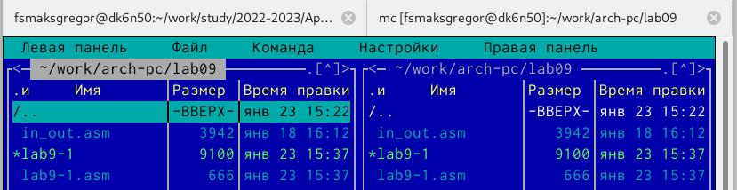{ #fig:1 width=110% }

- Затем мы заполнили код нашей программы в файле lab9-1.asm. (рис. [-@fig:2])

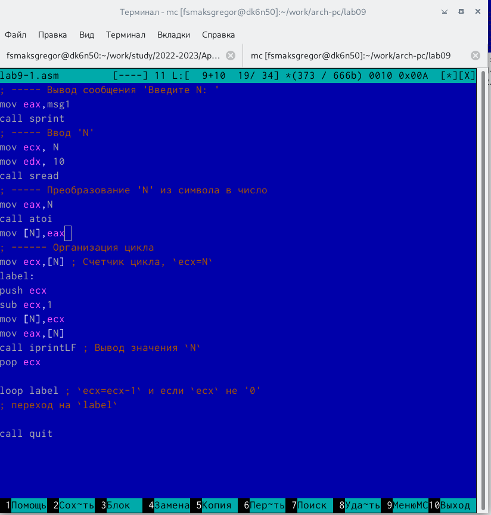{ #fig:2 width=110% }

- После этого мы скомпилировали файл, создали исполняемый файл и про-
верили его работу.(рис. [-@fig:3])

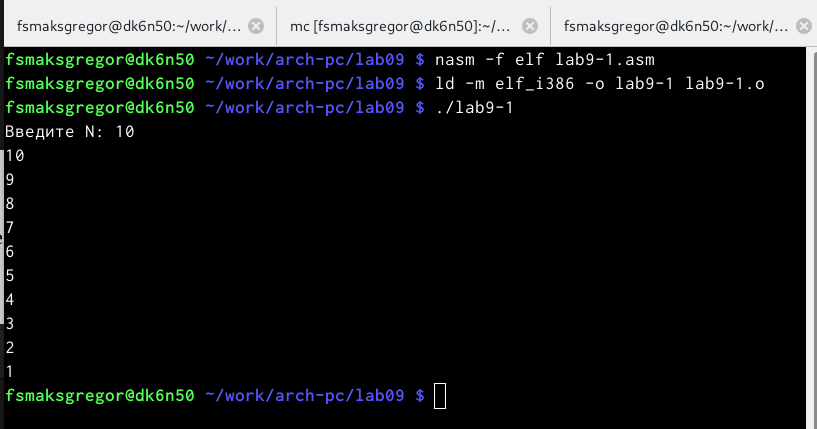{ #fig:3 width=110% }

- Мы внесли изменения в наш код, а затем создали исполняемый файл.(рис. [-@fig:4])

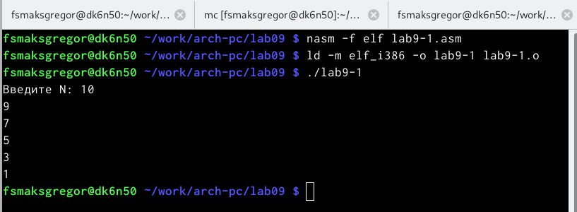{ #fig:4 width=110% }

- Регистр ecx принимает пять значений, которые являются: 9,7,5,3,1, мы можем заметить, что количество циклов не соответствует числу, введенному пользователем

- На этот раз мы использовали стек , и в конечном итоге количество циклов
соответствует числу, которое было введено в начале.(рис. [-@fig:5])

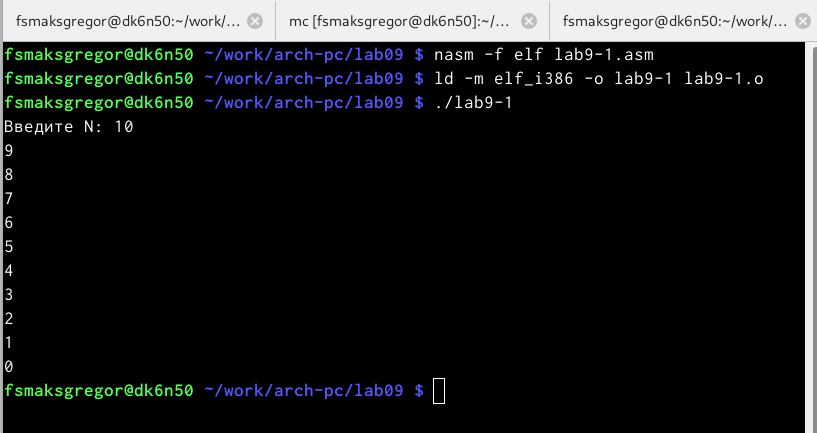{ #fig:5 width=110% }

## Обработка аргументов командной строки :

- На этом шаге мы создали файл lab9-2.asm, затем заполнили в нем наш
код.(рис. [-@fig:6])

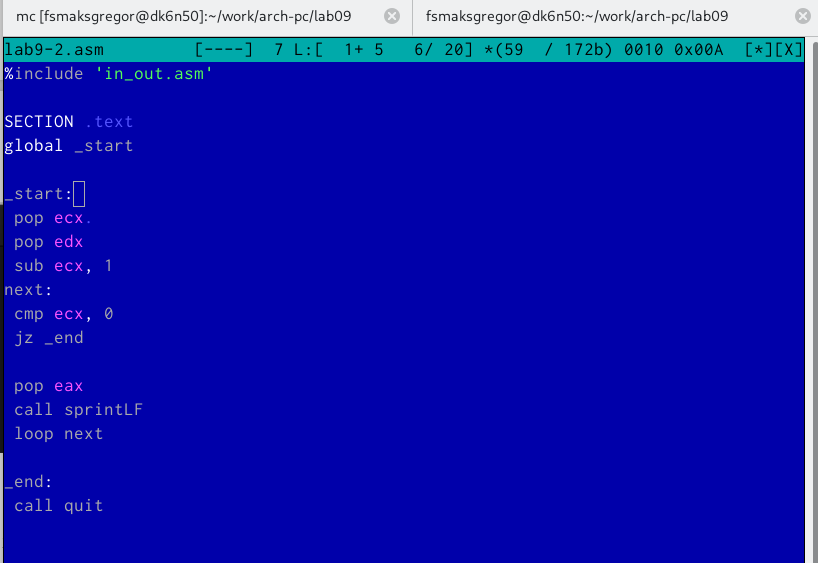{ #fig:6 width=110% }

- После этого мы скомпилировали файл и создали исполняемый файл.(рис. [-@fig:7])

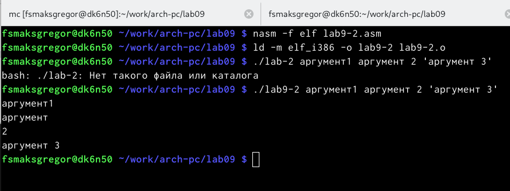{ #fig:7 width=110% }

- И, как вы можете видеть, на этот раз при запуске программы мы добавили
в команду три аргумента, и в этом случае были обработаны три аргумента.

## Программа вычисления суммы аргументов командной строки :

- Первым делом мы создали файл lab9-3.asm, затем заполнили кодом программы.(рис. [-@fig:8])

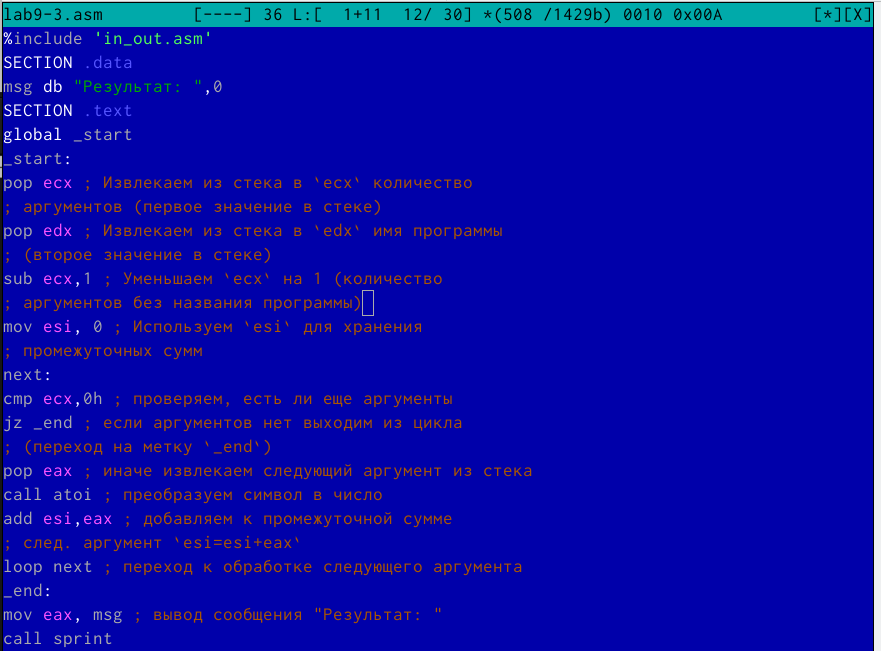{ #fig:8 width=110% }

- После этого мы скомпилировали файл, затем создали исполняемый файл,
ввели нужное количество аргументов и запустили prgoram.(рис. [-@fig:9])

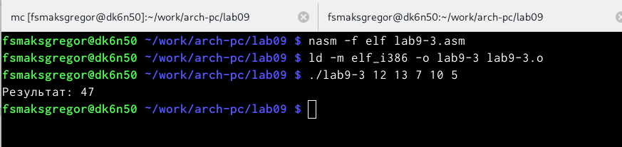{ #fig:9 width=110% }

- Затем мы изменили код, чтобы вычислить произведение аргументов ко-
мандной строки.(рис. [-@fig:10])

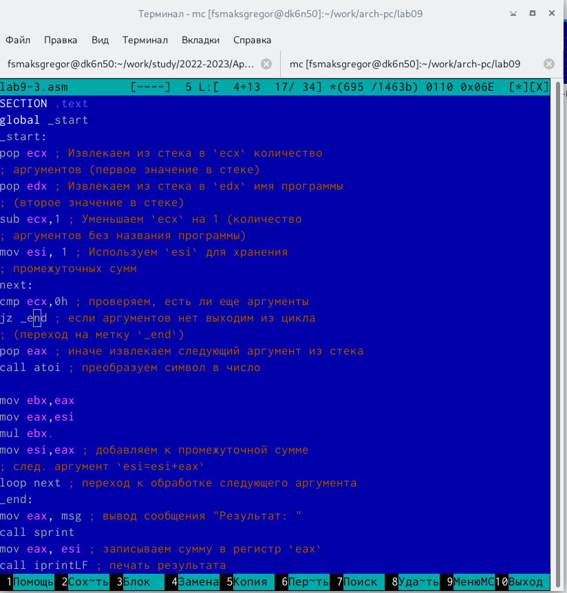{ #fig:10 width=110% }

- После этого e скомпилировал код и запустил исполняемый файл.(рис. [-@fig:11])

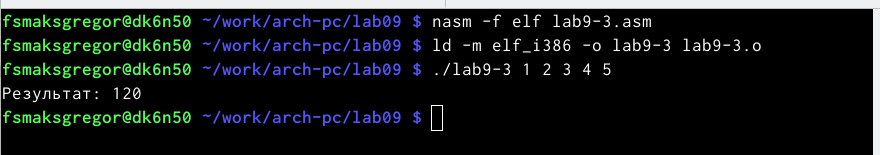{ #fig:11 width=110% }

## Выводы по результатам выполнения заданий :

- В этой части работы мы узнали, как манипулировать циклами, как правиль-
но использовать стек для написания программ

# Задание для самостоятельной работы :

- В этой части мы должны были написать программу,которая находит сумму
значений функции f(x) для x = x1, x2, ..., x

- сначала мы создали наш файл test.asm, где будет находиться наш код, затем
мы написали программу.(рис. [-@fig:12])

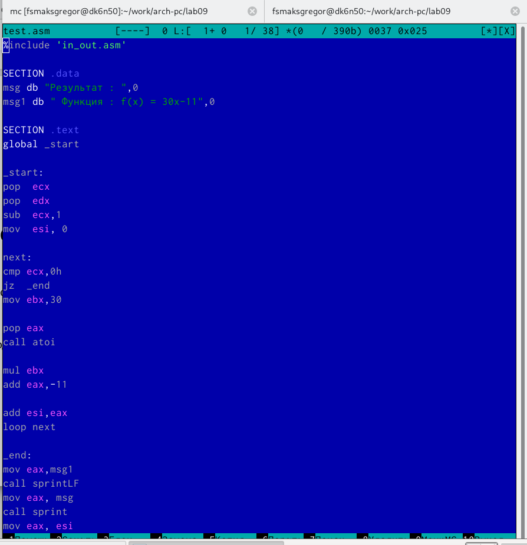{ #fig:12 width=110% }

- Затем мы протестировали нашу программу.(рис. [-@fig:1])

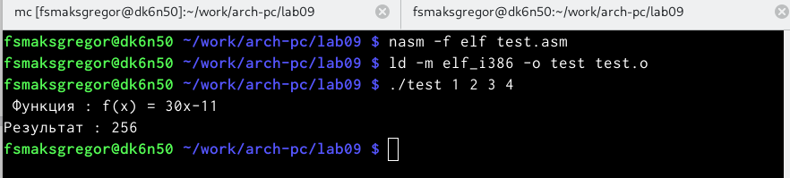{ #fig:13 width=110% }

## Выводы по результатам выполнения заданий :
В этой части мы узнали, как вычислить сложную математическую операцию,
которая имеет функции, используя циклы и стек.

# Выводы, согласованные с целью работы :

- В девятой лабораторной работе мы узнали, как использовать циклы и стек
в NASM.

# Список литературы{.unnumbered}

::: {#refs}
:::
