---
## Front matter
title: "Шаблон отчёта по лабораторной работе"
subtitle: "№10"
author: "Сильвен Макс Грегор Филс , НКАбд-03-22"

## Generic otions
lang: ru-RU
toc-title: "Содержание"

## Bibliography
bibliography: bib/cite.bib
csl: pandoc/csl/gost-r-7-0-5-2008-numeric.csl

## Pdf output format
toc: true # Table of contents
toc-depth: 2
lof: true # List of figures
lot: true # List of tables
fontsize: 12pt
linestretch: 1.5
papersize: a4
documentclass: scrreprt
## I18n polyglossia
polyglossia-lang:
  name: russian
  options:
	- spelling=modern
	- babelshorthands=true
polyglossia-otherlangs:
  name: english
## I18n babel
babel-lang: russian
babel-otherlangs: english
## Fonts
mainfont: PT Serif
romanfont: PT Serif
sansfont: PT Sans
monofont: PT Mono
mainfontoptions: Ligatures=TeX
romanfontoptions: Ligatures=TeX
sansfontoptions: Ligatures=TeX,Scale=MatchLowercase
monofontoptions: Scale=MatchLowercase,Scale=0.9
## Biblatex
biblatex: true
biblio-style: "gost-numeric"
biblatexoptions:
  - parentracker=true
  - backend=biber
  - hyperref=auto
  - language=auto
  - autolang=other*
  - citestyle=gost-numeric
## Pandoc-crossref LaTeX customization
figureTitle: "Рис."
tableTitle: "Таблица"
listingTitle: "Листинг"
lofTitle: "Список иллюстраций"
lotTitle: "Список таблиц"
lolTitle: "Листинги"
## Misc options
indent: true
header-includes:
  - \usepackage{indentfirst}
  - \usepackage{float} # keep figures where there are in the text
  - \floatplacement{figure}{H} # keep figures where there are in the text
---

# Цель работы
 
 - В этой лабораторной работе мы научимся писать программы с использованием
подпрограмм и познакомимся со способами отладки с использованием GDB и
его основными функциями

# Выполнение лабораторной работы :

## Реализация циклов в NASM :

- Здесь мы начали с создания каталога для программаы лабораторной работы
No10, а затем переместились в десятой каталог лаборатории “~/work/arch-
pc/lab10”, после чего мы создали файл “lab10-1.asm”. (рис. [-@fig:1])

{ #fig:1 width=110% }

- Затем мы заполнили код нашей программы в файле lab10-1.asm.(рис. [-@fig:2])

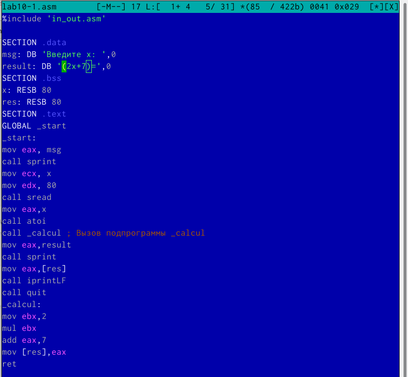{ #fig:2 width=110% }

- После этого мы скомпилировали файл, создали исполняемый файл и про-
верили его работу.(рис. [-@fig:3])

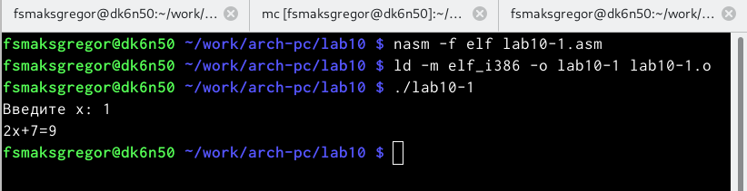{ #fig:3 width=110% }

- Мы внесли изменения в наш код ,чтобы она вычислила это уравнение
f(g(x)), где x вводится с клавиатуры и f(x) = 2x + 7, g(x) = 3x − 1 а затем создали исполняемый файл.(рис. [-@fig:4])(рис. [-@fig:5])

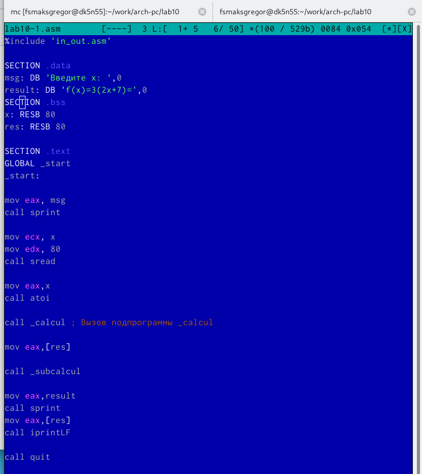{ #fig:4 width=110% }

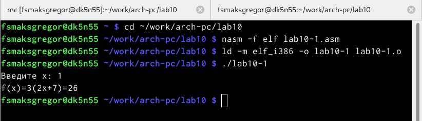{ #fig:5 width=110% }

## Отладка программам с помощью GDB :

- На этом шаге мы создали файл lab10-2.asm с текстом программы из ли-
стинга 10.2.(рис. [-@fig:6])

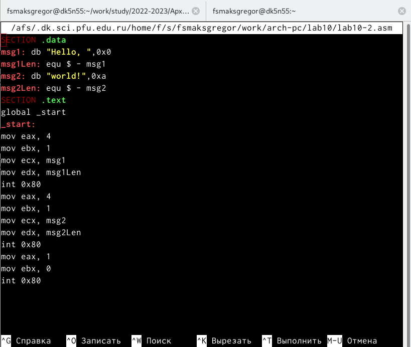{ #fig:6 width=110% }

- После этого мы скомпилировали файл, создали исполняемый файл.Затем
мы загрузили исполняемый файл в отладчик GDM. (рис. [-@fig:7])

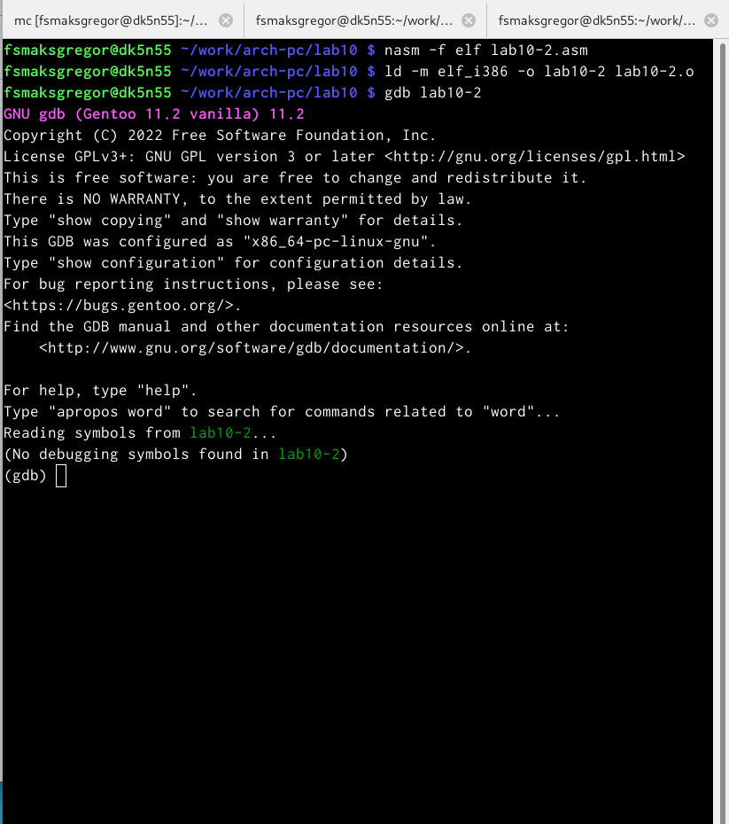{ #fig:7 width=110% }

- затем мы проверили работу программы, запустив ее в оболочке GDB с
помощью команды run.(рис. [-@fig:8])

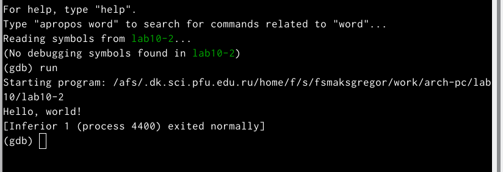{ #fig:8 width=110% }

-  затем мы установили точку останова на метке **_start**, которая запускает
выполнение любой программы на ассемблере, и запустили ее.(рис. [-@fig:9])

{ #fig:9 width=110% }

- Затем мы просмотрели разобранный программный код, используя команду
disassemble, начинающуюся с метки **_start**. (рис. [-@fig:10])

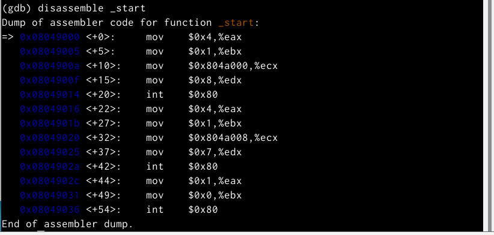{ #fig:10 width=110% }

- после этого мы переключились на отображение команд с синтаксисом
Intel, введя команду set disassembly-flavor intel.(рис. [-@fig:11])

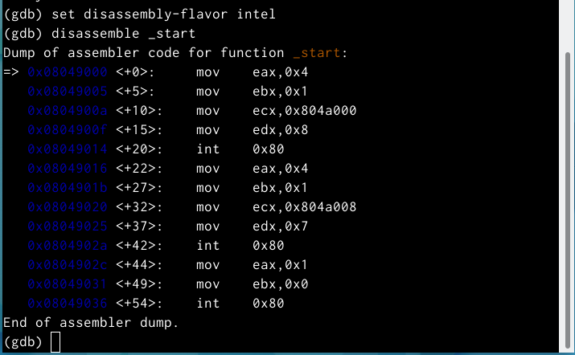{ #fig:11 width=110% }

- Разница в синтаксисе между AT&T и INTEL заключается в том, что AT&T
использует синтаксис mov $0x4,%eax, который популярен среди пользова-
телей Linux, с другой стороны, INTEL использует синтаксис mov eax,0x4 ,
который является популярен среди пользователей Windows.

- Затем мы включили псевдографический режим для более удобного анализа
программы. (рис. [-@fig:12])

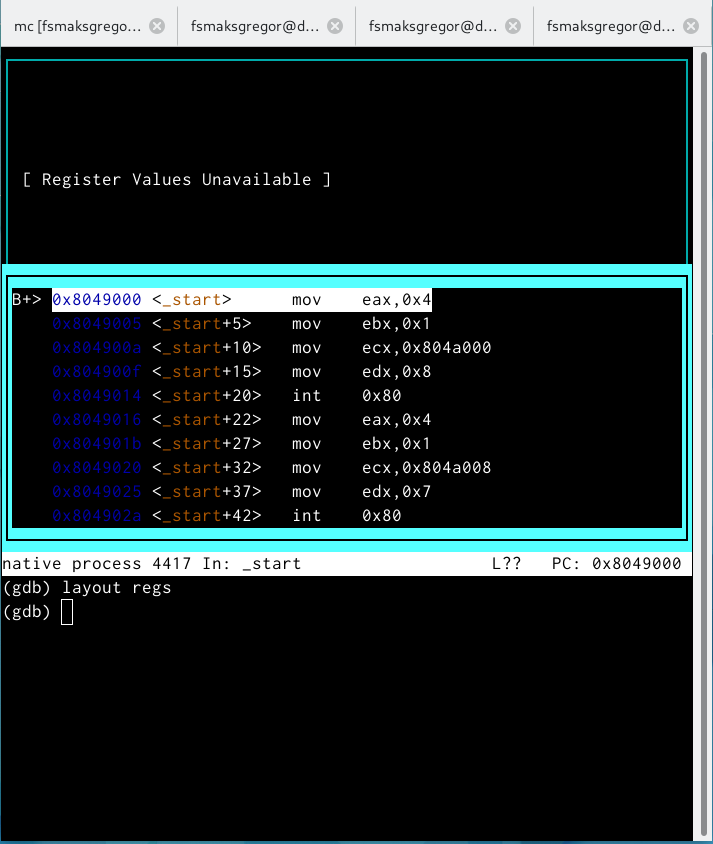{ #fig:12 width=110% }

## Добавление точек останова :

- Мы проверили точку останова с помощью информационных точек останова.(рис. [-@fig:13])

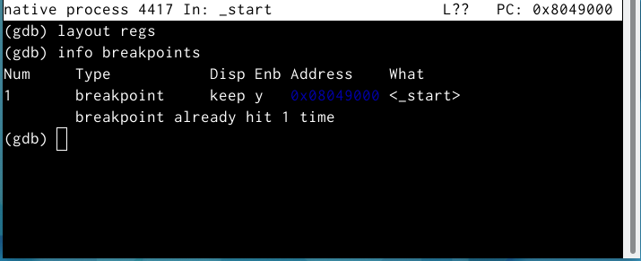{ #fig:13 width=110% }

- Mы определили адрес предпоследней инструкции (mov ebx,0x0) и устано-
вили точку останова.(рис. [-@fig:14])

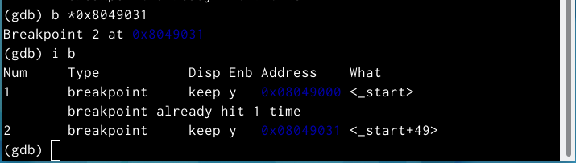{ #fig:14 width=110% }

## Работа с данными программы в GDB :

- На этом шаге мы следовали 5 инструкциям, используя командный шаг i, и
отслеживали изменение значений регистров, но перед этим мы проверили
предыдущие значения регистров.(рис. [-@fig:15])(рис. [-@fig:16])

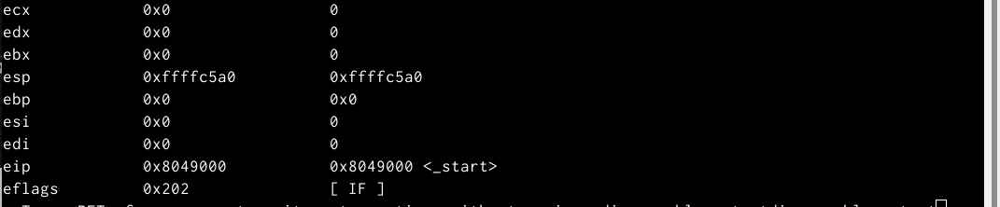{ #fig:15 width=110% }

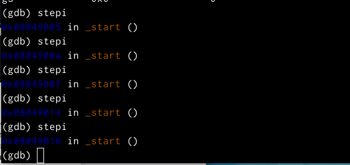{ #fig:16 width=110% }
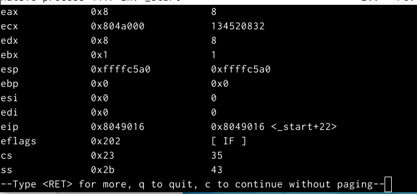{ #fig:16 width=110% }

- После проверки мы видим, что регистры : eax,ecx,edx,ebx,esp изменили
свое значение.

- Mы рассмотрели значение переменной msg1 по имени, используя команду
x/1sb.(рис. [-@fig:17])

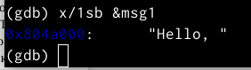{ #fig:17 width=110% }

- Здесь мы рассмотрели значение переменной msg2, используя адрес.(рис. [-@fig:18])

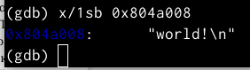{ #fig:18 width=110% }

- Здесь мы изменили первую букву переменной msg1, которая имеет тип
char.(рис. [-@fig:19])

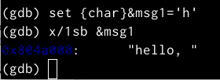{ #fig:19 width=110% }

- После этого мы изменили первую букву переменной msg2.(рис. [-@fig:20])

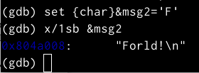{ #fig:20 width=110% }

- Затем мы выводим значение регистра edx в различных форматах (шестна-
дцатеричном, двоичном и символьном).(рис. [-@fig:21])

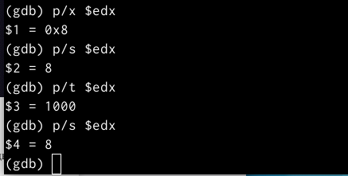{ #fig:21 width=110% }

- Используя команду set, мы изменили значение регистра ebx, когда раз,
введя ‘2’, а в другой раз, введя 2.(рис. [-@fig:22])

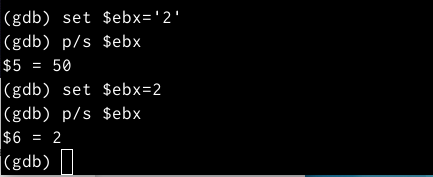{ #fig:22 width=110% }

- но когда мы напечатали значение регистра, мы получили значение 50 и это
потому, что машина интерпретировала введенное значение как символ, и в
таблице ASCII символ ‘2’ имеет значение 50 в десятичной системе, но когда
мы ввели значение 2 машина интерпретировала 2 как число в десятичной
системе.

- Наконец, мы завершили программу с помощью stepi и вышли из GDB с
помощью команды quit.(рис. [-@fig:23])

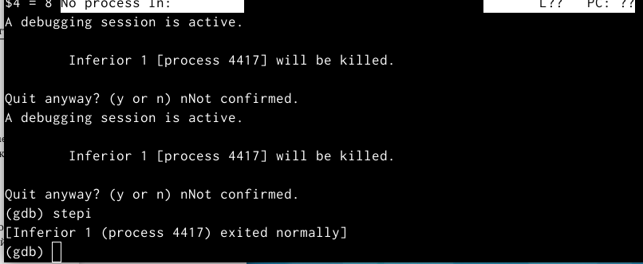{ #fig:23 width=110% }

## Обработка аргументов командной строки в GDB :

- На этом этапе мы скопировали файл lab9-2.asm, созданный при выполне-
нии лабораторной работы No9 с программой, отображающей аргументы
командной строки на экране (листинг 9.2), в файл с именем lab 10-3.asm, а
затем мы скомпилировали этот файл и установил точку останова в **_start**
и запустил отладчик.(рис. [-@fig:24])

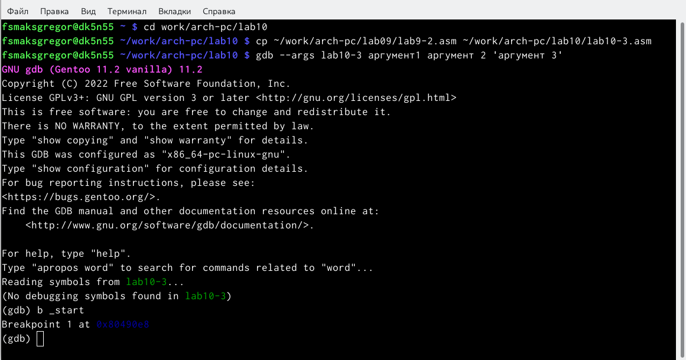{ #fig:24 width=110% }

- Затем мы посмотрели на остальные позиции стека – адрес в памяти, где
находится имя программы, находится в [esp + 4], адрес первого аргумента
хранится в [esp +8], в [esp +12].(рис. [-@fig:25])

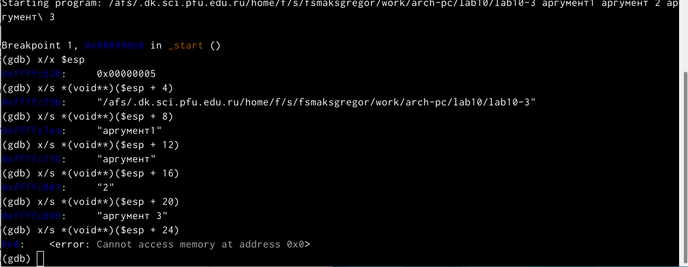{ #fig:25 width=110% }

- Шаг изменения адреса равен 4, потому что размер регистра esp равен 32би-
там = 4 байтам, а количество памяти равно количеству аргументов плюс
имя программы, поэтому мы получили 5 шагов с 4 байтами для каждого
шага.

## Выводы по результатам выполнения заданий :

- В этой части работы мы узнали, как работать с отладчиком GDB, и получили
более близкое представление о том, как работают подпрограммы.

# Задание для самостоятельной работы :

- Преобразуйте программу из лабораторной работы №9 (Задание №1 для
самостоятельной работы), реализовав вычисление значения функции f(x)
как подпрограмму. (рис. [-@fig:016] [-@fig:017])

{ #fig:016 width=70%, height=70% }

{ #fig:017 width=70%, height=70% }

7. В листинге приведена программа вычисления выражения (3+2)*4+5.
При запуске данная программа дает неверный результат. Проверьте это.
С помощью отладчика GDB, анализируя изменения значений регистров,
определите ошибку и исправьте ее.(рис. [-@fig:018] [-@fig:019] [-@fig:020] [-@fig:021])

{ #fig:018 width=70%, height=70% }

{ #fig:019 width=70%, height=70% }

Отметим, что перепутан порядок аргументов у инструкции add и что по окончании работы в edi 
отправляется ebx вместо eax

{ #fig:020 width=70%, height=70% }

## Выводы по результатам выполнения заданий :

- В этой части мы узнали, как превратить программу в подпрограмму, но
у нас возникла проблема с подпрограммой atoi , поэтому мы не смогли
вычислить результат.

# Выводы, согласованные с целью работы :

- В этой лабораторной работе мы научимся писать программы с использова-
нием подпрограмм и познакомимся со способами отладки с использовани-
ем GDB и его основными функциями.

# Список литературы{.unnumbered}

::: {#refs}
:::
