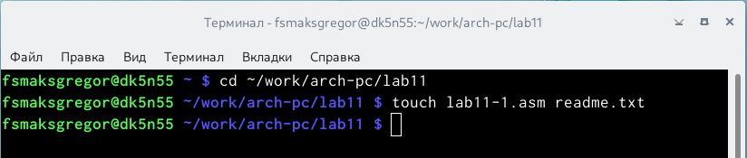
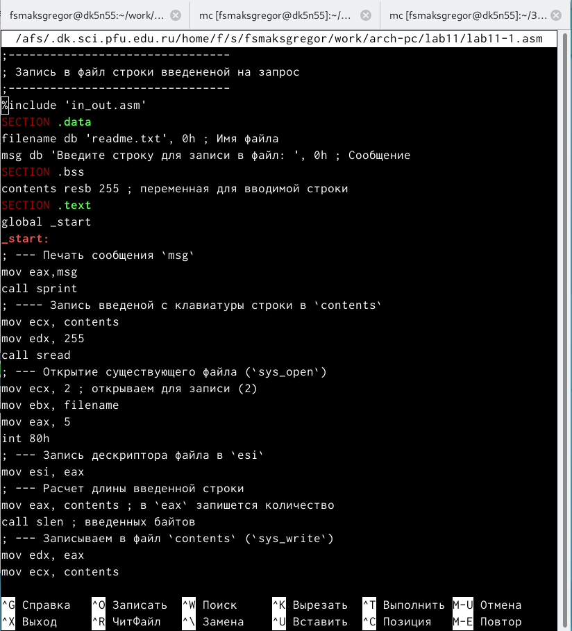
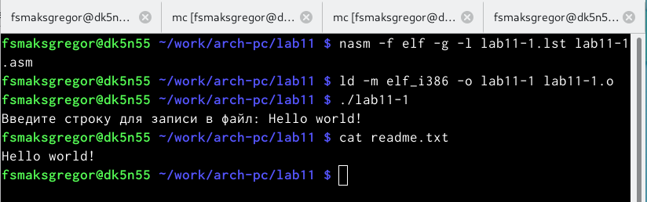
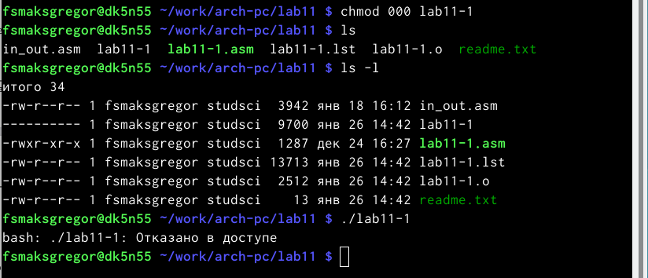
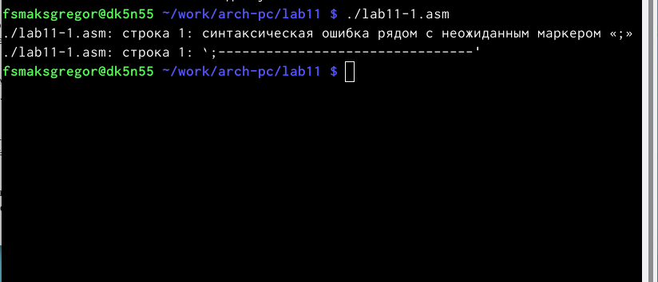
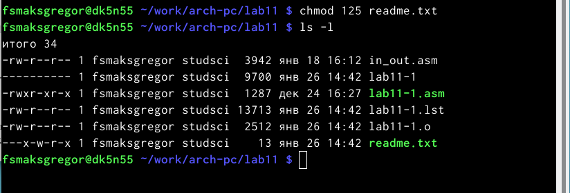
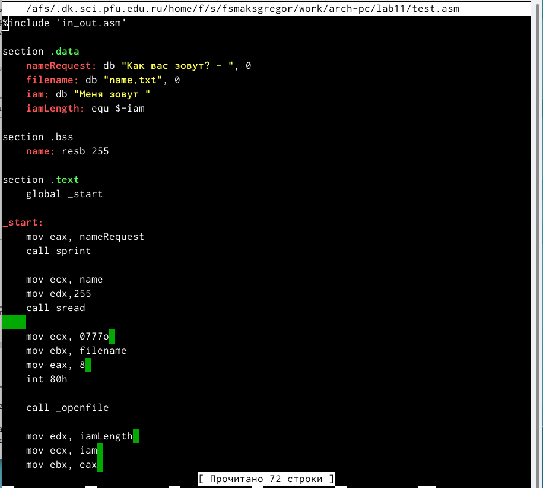
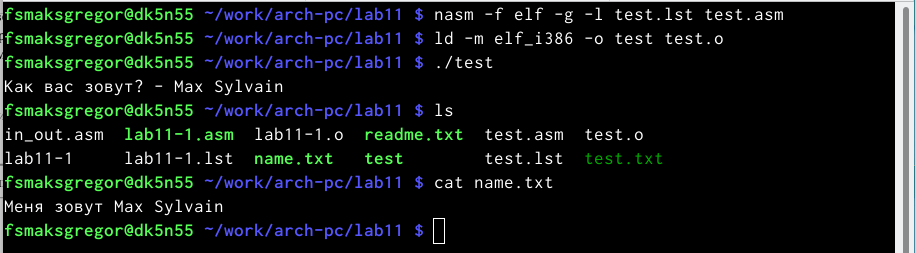

---
## Front matter
title: "Шаблон отчёта по лабораторной работе"
subtitle: "11"
author: "Сильвен Макс Грегор Филс , НКАбд-03-22"

## Generic otions
lang: ru-RU
toc-title: "Содержание"

## Bibliography
bibliography: bib/cite.bib
csl: pandoc/csl/gost-r-7-0-5-2008-numeric.csl

## Pdf output format
toc: true # Table of contents
toc-depth: 2
lof: true # List of figures
lot: true # List of tables
fontsize: 12pt
linestretch: 1.5
papersize: a4
documentclass: scrreprt
## I18n polyglossia
polyglossia-lang:
  name: russian
  options:
	- spelling=modern
	- babelshorthands=true
polyglossia-otherlangs:
  name: english
## I18n babel
babel-lang: russian
babel-otherlangs: english
## Fonts
mainfont: PT Serif
romanfont: PT Serif
sansfont: PT Sans
monofont: PT Mono
mainfontoptions: Ligatures=TeX
romanfontoptions: Ligatures=TeX
sansfontoptions: Ligatures=TeX,Scale=MatchLowercase
monofontoptions: Scale=MatchLowercase,Scale=0.9
## Biblatex
biblatex: true
biblio-style: "gost-numeric"
biblatexoptions:
  - parentracker=true
  - backend=biber
  - hyperref=auto
  - language=auto
  - autolang=other*
  - citestyle=gost-numeric
## Pandoc-crossref LaTeX customization
figureTitle: "Рис."
tableTitle: "Таблица"
listingTitle: "Листинг"
lofTitle: "Список иллюстраций"
lotTitle: "Список таблиц"
lolTitle: "Листинги"
## Misc options
indent: true
header-includes:
  - \usepackage{indentfirst}
  - \usepackage{float} # keep figures where there are in the text
  - \floatplacement{figure}{H} # keep figures where there are in the text
---

# Цель работы

- В этой лабораторной работе мы научимся писать программы с использованием
подпрограмм и познакомимся со способами отладки с использованием GDB и
его основными функциями

# Выполнение лабораторной работы :

- Здесь мы начали с создания каталога для программаы лабораторной работы
No11, а затем переместились в десятой каталог лаборатории “~/work/arch-
pc/lab10”, после чего мы создали файл “lab11-1.asm” и “readme.txt”.(рис. [-@fig:1])

{ #fig:1 width=110% }

- Затем мы заполнили код нашей программы в файле lab10-1.asm.(рис. [-@fig:2])

{ #fig:2 width=110% }

- После этого мы скомпилировали файл, создали исполняемый файл и про-
верили его работу.(рис. [-@fig:3])

{ #fig:3 width=110% }

- Используя команду chmod, мы изменили права доступа к исполняемому
файлу lab11-1, запретив его выполнение.(рис. [-@fig:4])

{ #fig:4 width=110% }

- После этого мы попытались запустить исполняемый файл, но без каких-
либо результатов, и это потому, что у нас нет доступа для чтения этого
файла.

- На этом шаге с помощью команды chmod мы изменили права доступа
к файлу lab 11-1.asm с исходным кодом программы, добавив права на
выполнение.После этого мы попытались выполнить файл.(рис. [-@fig:5])

{ #fig:5 width=110% }

- Файл не был выполнен, потому что это файл с форматом .asm , который
содержит код, но не скомпилированный.

- На этом шаге мы предоставили доступ к файлу readme.txt в соответствии с
имеющимся у нас вариантом (в моем случае это 16)(рис. [-@fig:6])

{ #fig:6 width=110% }

## Выводы по результатам выполнения заданий :

- В этой части работы мы узнали, как работать с отладчиком GDB, и получили
более близкое представление о том, как работают подпрограммы.

# Задание для самостоятельной работы :

- Здесь мы написали программу, которая работает по следующему алгоритму
 (рис. [-@fig:7])

{ #fig:7 width=110% } 
- Вывод приглашения “Как Вас зовут?”
- ввести с клавиатуры свои фамилию и имя
- создать файл с именем name.txt
- записать в файл сообщение “Меня зовут”
- дописать в файл строку введенную с клавиатуры
- закрыть файл

- Наконец, мы создали исполняемый файл и проверяем его работу. Проверьте
наличие файла и его содержимого с помощью команд ls и cat.(рис. [-@fig:8])

{ #fig:8 width=110% }

## Выводы по результатам выполнения заданий :

- В этой части мы использовали полученные навыки для создания программ,
работающих с файлами.

# Выводы

- В этой лабораторной работе мы узнаем, как писать программы, которые
работают с файлами (создание, запись, модификация и удаление) в Nasm

# Список литературы{.unnumbered}

::: {#refs}
:::
